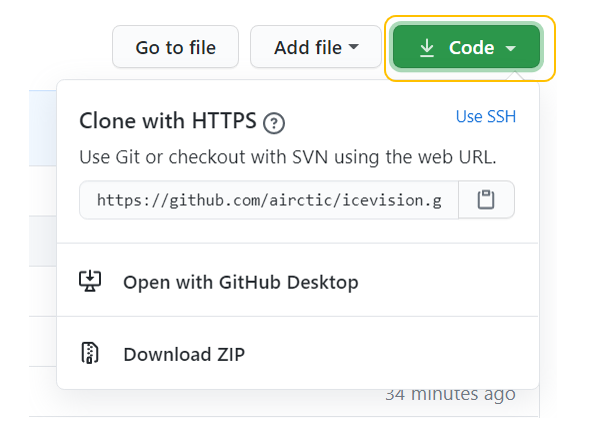
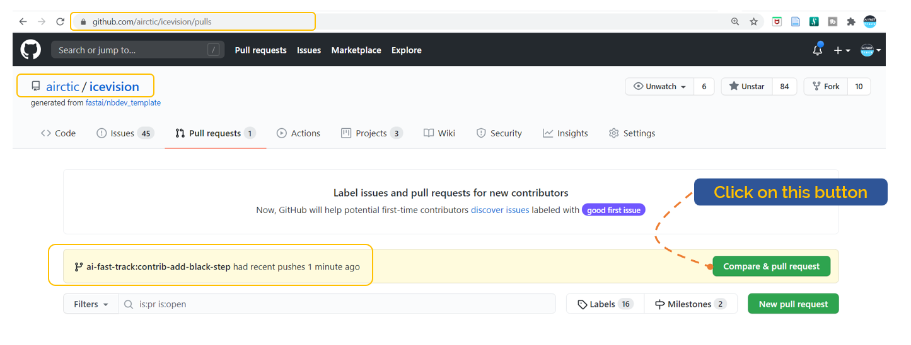
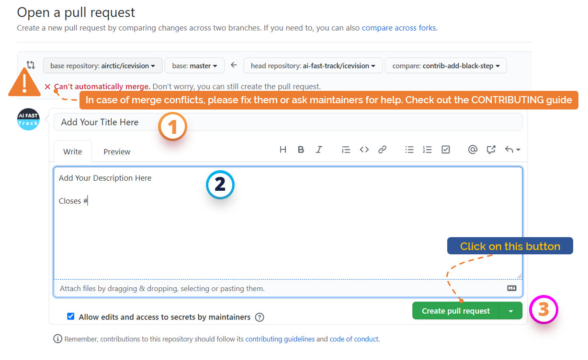

# Contribution Guide

!!! info "We value your contribution"
    We are both a welcoming and an open community.
    We warmly invite you to join us either as a user or a community contributor.
    We will be happy to hear from you.


**Please, follow these steps**

## Step 1: Forking and Installing IceVision

​1. Fork the repo to your own github account. click the Fork button to
create your own repo copy under your GitHub account. Once forked, you're
responsible for keeping your repo copy up-to-date with the upstream
icevision repo.


​2. Download a copy of your remote username/icevision repo to your
local machine. This is the working directory where you will make
changes:



```bash
git clone https://github.com/username/icevision.git
cd icevision
```

3.  Install icevision as an editable package. As a best practice, it is highly recommended to create either a mini-conda or a conda environment. Please, check out our [Installation Using Conda Guide](https://airctic.com/install/#b-installation-using-conda).

First, install Poetry by following the instructions [here](https://python-poetry.org/docs/#installation).

Then, to locally install the package:

```bash
poetry install -E all
poetry add omegaconf git+https://github.com/rwightman/efficientdet-pytorch.git
```

## Step 2: Stay in Sync with the original (upstream) repo

1.  Set the upstream to sync with this repo. This will keep you in sync
    with icevision easily.

```bash
git remote add upstream https://github.com/airctic/icevision.git
```

2.  Updating your local repo: Pull the upstream (original) repo.

```bash
git checkout master
git pull upstream master
```

## Step 3: Creating a new branch

```bash
git checkout -b feature-name
git branch

  master
  * feature_name:
```

## Step 4: Make changes, and commit your file changes

Edit files in your favorite editor, and format the code with
[black](https://black.readthedocs.io/en/stable/)

```bash
# View changes
git status  # See which files have changed
git diff    # See changes within files

git add path/to/file
git commit -m "Your meaningful commit message for the change."
```

Add more commits, if necessary.


## Step 5: Submitting a Pull Request

### 1. Create a pull request git

Upload your local branch to your remote GitHub repo
(github.com/username/icevision)

```bash
cd to/icevision/folder
black .
git push
```

After the push completes, a message may display a URL to automatically
submit a pull request to the upstream repo. If not, go to the
icevision main repo and GitHub will prompt you to create a pull
request.



Fill out the **Title** and the **Description** of your pull request. Then, click the **Submit Pull Request**
### 2. Confirm PR was created:

Ensure your PR is listed
[here](https://github.com/airctic/icevision/pulls)




### 3.  Updating a PR:

Same as before, normally push changes to your branch and the PR will get
automatically updated.

```bash
git commit -m "updated the feature"
cd to/icevision/folder
black .
git push origin <enter-branch-name-same-as-before>
```

* * * * *

## Reviewing Your PR

Maintainers and other contributors will review your pull request. Please
participate in the discussion and make the requested changes. When your
pull request is approved, it will be merged into the upstream
icevision repo.

> **note**
>
> IceVision has CI checking. It will automatically check your code
> for build as well.

## Resolving Conflicts

In your PR, you will see the message like below when the branch is
not synced properly or changes were requested.

> "This branch has conflicts that must be resolved"

Click **Resolve conflicts** button near the bottom of your pull request.
Then, a file with conflict will be shown with conflict markers `<<<<<<<`,
`=======`, and `>>>>>>>`.

```
<<<<<<< edit-contributor
Local Change
=======
Remote Change
>>>>>>> master
```

The line between `<<<<<<<` and `=======` is your local change and
the line between `=======` and `>>>>>>>` is the remote change. Make the
changes you want in the final merge.

Click **Mark as resolved** button after you've resolved all the conflicts.
You might need to select next file if you have more than one file with a
conflict.

Click **Commit merge** button to merge base branch into the head branch.
Then click **Merge pull request** to finish resolving conflicts.

## Feature Requests and questions

For Feature Requests and more questions raise a github
[issue](https://github.com/airctic/icevision/issues/). We will be happy
to assist you.

Be sure to check the
[documentation](https://airctic.github.io/icevision/index.html).
